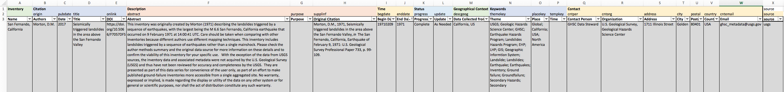

# EQIL_metadata

## Introduction

GF_metadata is a supplemental tool used to create separate metadata files, following the USGS geospatial metadata format, for a series of datasets.  The code documentation can be found at: 

The format for USGS geospatial metadata can be found here: https://www.fgdc.gov/standards/projects/FGDC-standards-projects/metadata/base-metadata/v2_0698.pdf

Disclaimer: This software is preliminary or provisional and is subject to revision. It is being provided to meet the need for timely best science. The software has not received final approval by the U.S. Geological Survey (USGS). No warranty, expressed or implied, is made by the USGS or the U.S. Government as to the functionality of the software and related material nor shall the fact of release constitute any such warranty. The software is provided on the condition that neither the USGS nor the U.S. Government shall be held liable for any damages resulting from the authorized or unauthorized use of the software.

## Installation and Dependencies

This script requires packages that are available through the scipy installation.

'
#stdlib imports
from collections import OrderedDict
import pandas as pd
import dicttoxml
from xml.dom.minidom import parseString, parse
import xml.etree.ElementTree as ET
import os
'

## Usage Example

Running this code requires a CSV file specified exactly so in order to be read into the code exactly as needed.  This file is organized based off of three rows of the titles.  Row 1 has the main metadata classifications, Row 2 has the metadata item names, and Row 3 has a general description for the user.  The CSV file should have the following categories:

|Row 1 Name|Row 2 Name|Row 3 Name|
|---|---|---|
|Inventory| |Name|
|Citation|origin|Authors|
| |pubdate|Date|
| |title|Title|
| |onlink|DOI|
|Description|abstract|Abstract|
| |purpose|Purpose|
| |supplinf|Original Citation|
|Time|begdate|Begin Date|
| |enddate|End Date|
|Status|progress|Progress|
| |update|Update|
|Geographical Context|descgeog|Data Collected from:|
|Keywords|themekey|Theme|
| |placekey|Place|
| |tempkey|Time|
|Contact|cntper|Contact Person|
| |cntorg|Organization|
| |address|Address|
| |city|City|
| |postal|Postal|
| |country|Country|
| |cntemail|Email|
|source|source|source|

An example of this setup can be seen in the figure below.

To run the script, change lines 15 and 18. Line 15 should point to the CSV file being used.  Line 18 points to the output directory for results.
